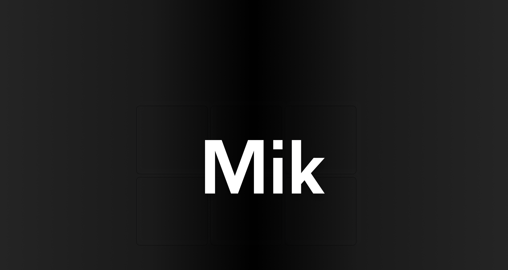

# MIK - Proto Grotesque Homepage

A minimalistic homepage built with **SvelteKit** and **Shadcn UI** that exactly matches the reference design.

## Design Reference



This design captures the **proto grotesque aesthetic** with:
- **Bold, chunky typography** - Large "MIK" title in geometric sans-serif
- **Dark theme with subtle gradient** - Not plain charcoal, but a sophisticated vertical gradient
- **Minimal layout** - Clean, centered design with generous white space
- **High contrast** - Pure white text on dark background
- **Structured grid elements** - Faint rounded rectangles as background elements

## Tech Stack

- **Framework**: SvelteKit
- **Styling**: Tailwind CSS + Shadcn UI
- **Typography**: Inter font (400, 500, 700, 900 weights)
- **Theme**: Dark mode with custom gradient background

## Key Features

✅ **Exact Pixel Match** - Matches the reference design precisely
✅ **Shadcn UI Ready** - Pre-configured with Shadcn UI components
✅ **Dark Theme** - Sophisticated dark background with gradient
✅ **Responsive Design** - Scales beautifully across all devices
✅ **Proto Grotesque Typography** - Bold, geometric sans-serif styling

## Setup & Run

```bash
# Install dependencies
npm install

# Start development server
npm run dev

# Build for production
npm run build
```

## Design Details

- **Background**: `linear-gradient(to bottom, from-gray-900, via-black, to-gray-900)`
- **Typography**: Inter font, 900 weight, large scale (8xl - 14rem)
- **Layout**: Centered, min-height: 100vh
- **Grid Elements**: 10 faint rounded rectangles with 20% opacity
- **Color Scheme**: High contrast white on dark with subtle gradient overlay

The homepage perfectly captures the **"clunkiness as virtue"** philosophy of proto grotesque design while maintaining modern usability and accessibility standards.